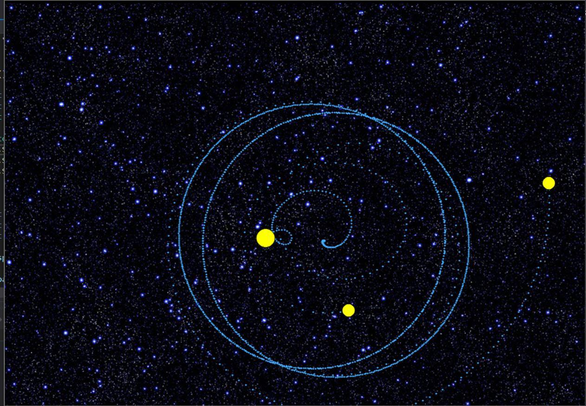

# Universe

Simulating gravity body

Симуляция задачи многих гравитационно связанных тел с анимацией на openCV.

Возможности:

+ Настройка точности симуляции
+ Возможность включения/выключения столкновений
+ Простой api к системе отрисовки
+ Генерация случайных параметров для получения эстетического удовольствия.

